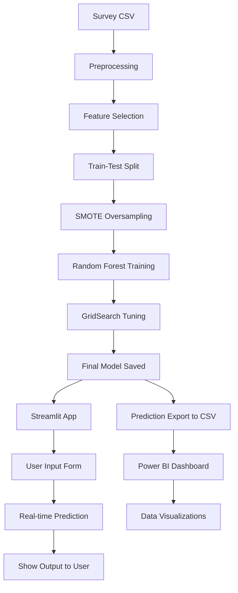

# Mental-Health-Treatment-Prediction
Mental health awareness is a growing concern, especially in corporate and tech environments. This project uses machine learning to predict whether an individual will seek mental health treatment based on survey data. The solution includes:  
1.A machine learning model  
2.A Streamlit web app for predictions  
3.A Power BI dashboard for insights  
Objectives  
Predict treatment-seeking behavior using survey responses  
Deploy a user-friendly prediction tool with Streamlit  
Visualize trends and patterns using Power BI  
Tech Stack  
Category	Tools Used  
ML & Preprocessing	scikit-learn, SMOTE, pandas, numpy  
Visualization	seaborn, matplotlib, Power BI  
Deployment	Streamlit, joblib  
Optional Explainability	SHAP / LIME  
Dataset  
Source: Kaggle - Mental Health in Tech Survey
Records: ~1,200  
Target Variable: treatment (Yes/No)  
Features Used  
Age  
Gender  
Family History  
Work Interference  
Remote Work  
Benefits  
Anonymity  
Wellness Program  
Leave  
Seek Help  
Care Options  
Self-Employed  
Tech Company  

Machine Learning Pipeline
Data Cleaning & Label Encoding
Feature Selection
Train-Test Split (Stratified)
SMOTE for Class Balance
Model: Random Forest Classifier
Hyperparameter Tuning: GridSearchCV
Final Accuracy: 83.5%  

Results  
Metric	Score  
Accuracy	83.5%  
F1-Score	0.83  
Recall	0.89  

###  Full System Architecture

